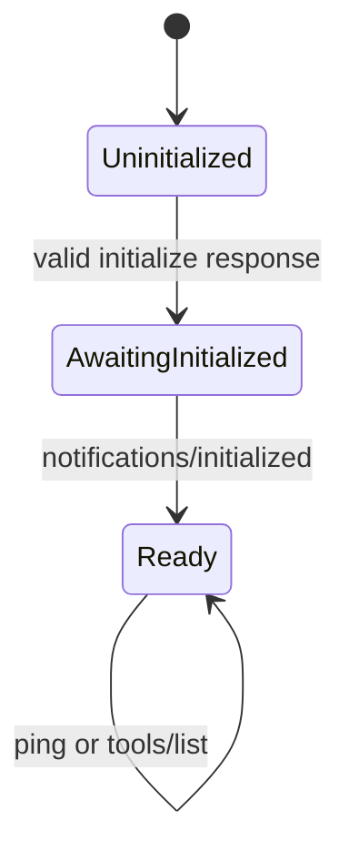

# Architecture

## Purpose

Native MCP Sandbox mediates between a local MCP client and, in later phases, a small
collection of read-only Linux analysis tools. The design prioritizes explicit trust
boundaries, bounded resource use, deterministic protocol output, and compact evidence
suitable for an AI model's context.

Phase 1 implements the local protocol edge. It does not access the filesystem, process
table, network, or analysis data.

## Current Phase 1 data path

1. The executable reads stdin one byte at a time into a bounded line buffer.
2. A line longer than the request limit is drained and replaced with a size error.
3. nlohmann/json parses one JSON value from the complete line.
4. The dispatcher validates the JSON-RPC envelope, request ID, method, parameters,
   and MCP lifecycle state.
5. A bounded serializer creates at most one response for a request.
6. Complete response lines are written to stdout; diagnostics use stderr.

The implementation is synchronous. This gives Phase 1 one logical reader and writer
without prematurely introducing scheduling races.

## Trust boundaries

### Trusted for the current model

- the installed executable and resource configuration;
- the operating system and compiler toolchain; and
- the MCP host that launches the process.

### Untrusted

- every byte received through stdin;
- JSON structure, IDs, methods, and parameters;
- request order and lifecycle behavior;
- line length and connection termination; and
- future file contents and tool arguments.

## Current components

| Component | Current responsibility | Must not do |
| --- | --- | --- |
| Bounded stdio reader | Frame one line and drain oversized lines | Accumulate beyond the request budget |
| JSON-RPC validation | Parse and validate envelopes and IDs | Echo payloads in diagnostics |
| MCP lifecycle dispatcher | Handle initialize, initialized, ping, and tools/list | Advertise unavailable tools |
| Bounded serializer | Keep output within its byte budget | Partially write or interleave messages |
| Diagnostic path | Emit generic information to stderr | Write non-protocol text to stdout |

## Lifecycle state machine

`ping` is accepted in every state. `tools/list` is accepted only in `Ready` and
returns an empty array. Initialization cannot be repeated. An initialize response
that exceeds the response limit does not advance state.

## Resource invariants

1. Request buffering stops at a configured byte limit.
2. Oversized input is drained to the next newline before framing resumes.
3. A response cannot exceed its configured byte limit.
4. Stdout contains only complete protocol messages in server mode.
5. Notifications do not receive JSON-RPC responses.
6. Large host data will be processed incrementally in later phases.
7. Host-facing tools remain read-only unless the threat model is revised.

Phase 1 enforces the first five. Queue capacity, workers, deadlines, and cancellation
remain reserved for phases that introduce concurrent work.

## Dependency policy

Phase 1 uses system-provided nlohmann/json 3.11 or newer. CMake does not fetch it from
the network. The host distribution manages the package, and a compile-time assertion
checks the minimum version. See ADR 0004 and `THIRD_PARTY_NOTICES.md`.

## Planned boundary before tools

Phase 2 must add a fail-closed filesystem policy gate before any log tool exists. It
will need descriptor-aware containment, regular-file and size checks, denial of
special files, and adversarial traversal, symlink, and race tests. The MCP dispatcher
must not perform filesystem work directly.

## Portability

Phase 1 protocol code uses standard C++20. The process integration test and future
log, ELF, `/proc`, namespace, and seccomp features are Linux-specific. Linux is the
only promised target until automated evidence supports a broader claim.
