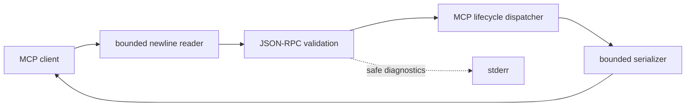

# Native MCP Sandbox

> A security-first, resource-bounded C++20 foundation for local AI-agent analysis tools.

Native MCP Sandbox explores how an AI agent can inspect selected local Linux evidence
without receiving unrestricted host access. The project is being built in narrow,
auditable phases: protocol handling first, policy enforcement before host access, and
analysis tools only after their security boundaries are testable.

## Project status

**Phase 1 — Minimal MCP lifecycle and stdio transport (`v0.2.0`)**

The executable now runs a small Model Context Protocol (MCP) server over standard
input and standard output. It implements initialization, ping, and tool discovery for
protocol revision `2025-11-25`. Tool discovery intentionally returns an empty list:
no filesystem, log, ELF, process, shell, or network capability is reachable.

| Available now | Deliberately not available yet |
| --- | --- |
| Newline-delimited JSON-RPC 2.0 over stdio | `tools/call` |
| MCP `initialize` and version negotiation | Filesystem or process access |
| `notifications/initialized` lifecycle transition | Log or ELF analysis |
| `ping` before and after initialization | Network listening or HTTP transport |
| `tools/list` returning `[]` after initialization | Coroutines, workers, or cancellation |
| 1 MiB bounded request and response handling | Benchmarks or performance claims |
| Unit and real-process stdio integration tests | OS-level sandboxing |

A protocol server is not yet an analysis sandbox merely because it can speak MCP.

## Implemented protocol behavior

The Phase 1 server:

- reads one UTF-8 JSON-RPC message per input line;
- writes only complete JSON-RPC response lines to stdout;
- sends diagnostics to stderr without echoing request contents;
- rejects malformed JSON, invalid envelopes, fractional IDs, and top-level arrays;
- accepts string, signed integer, unsigned integer, and null request IDs;
- validates initialization protocol version, capabilities, and client information;
- permits `ping` before and after initialization;
- requires `notifications/initialized` before `tools/list`;
- ignores unsupported notifications without sending protocol responses;
- returns method-not-found for unsupported requests;
- drains oversized lines without continuing to grow the request buffer; and
- exits successfully when stdin reaches EOF.

The server targets stable MCP revision `2025-11-25`. It does not silently claim
compatibility with other revisions.

## Security posture

Current Phase 1 controls include:

- no arbitrary command or binary execution;
- no file, process, or network access;
- bounded request and response sizes;
- lifecycle and parameter validation;
- one synchronous logical response writer;
- stdout isolated from diagnostics; and
- deterministic malformed-input and process-level tests.

Application validation cannot replace an operating-system sandbox. Filesystem policy,
descriptor-based containment, privilege reduction, namespaces, and seccomp are later
work and are not claimed here. See [`THREAT_MODEL.md`](THREAT_MODEL.md) and
[`SECURITY.md`](SECURITY.md).

## Resource profile

The default design target is a modest Linux laptop with 8 GB of RAM.

| Budget | Default |
| --- | ---: |
| Maximum request | 1 MiB |
| Maximum response | 1 MiB |
| Pending-request queue | 16 (reserved for later phases) |
| Worker threads | 2 (reserved for later phases) |
| Operation timeout | 30 seconds (reserved for later phases) |

Phase 1 actively enforces request and response byte limits. It remains synchronous,
so queue, worker, and timeout values are not yet applied to protocol work. Build
presets use at most two compilation jobs.

## Build and verify

### Requirements

- Linux
- CMake 3.20 or newer
- Ninja
- A C++20-capable GCC or Clang compiler
- system-provided [nlohmann/json](https://github.com/nlohmann/json) 3.11 or newer

On EndeavourOS/Arch Linux, install the `nlohmann-json` package. CMake does not download
or vendor the dependency.

### Development build

```bash
cmake --preset dev
cmake --build --preset dev
ctest --preset dev
./build/dev/native-mcp-sandbox --self-check
```

Expected self-check line:

```text
self-check passed: request_limit=1048576 response_limit=1048576 queue_limit=16 workers=2 timeout_ms=30000
```

### Sanitizer build

```bash
cmake --preset sanitizers
cmake --build --preset sanitizers
ctest --preset sanitizers
```

### Release build

```bash
cmake --preset release
cmake --build --preset release
ctest --preset release
```

The repository does not require Docker or a local language model.

## Try the protocol

```bash
./build/dev/native-mcp-sandbox <<'EOF'
{"jsonrpc":"2.0","id":1,"method":"initialize","params":{"protocolVersion":"2025-11-25","capabilities":{},"clientInfo":{"name":"demo-client","version":"1.0"}}}
{"jsonrpc":"2.0","method":"notifications/initialized"}
{"jsonrpc":"2.0","id":2,"method":"ping"}
{"jsonrpc":"2.0","id":3,"method":"tools/list"}
EOF
```

Expected stdout:

```jsonl
{"id":1,"jsonrpc":"2.0","result":{"capabilities":{"tools":{}},"protocolVersion":"2025-11-25","serverInfo":{"name":"native-mcp-sandbox","version":"0.2.0"}}}
{"id":2,"jsonrpc":"2.0","result":{}}
{"id":3,"jsonrpc":"2.0","result":{"tools":[]}}
```

The initialized notification receives no response.

## Architecture



A future policy gate will sit between the dispatcher and any host-facing tool. No
analysis implementation is present. See [`ARCHITECTURE.md`](ARCHITECTURE.md).

## Roadmap

1. **Phase 0:** foundation, constraints, build, tests, and CI — complete
2. **Phase 1:** minimal MCP lifecycle and JSON-RPC-over-stdio — current
3. **Phase 2:** filesystem policy gate and resource enforcement
4. **Phase 3:** streaming log-analysis tools
5. **Phase 4:** safe Linux ELF inspection
6. **Phase 5:** bounded `/proc` memory observation
7. **Phase 6:** coroutine orchestration, cancellation, and backpressure
8. **Phase 7:** fuzzing, sanitizer coverage, and security regression suite
9. **Phase 8:** deterministic agent investigation demonstration
10. **Phase 9:** reproducible benchmarks and reference comparison
11. **Phase 10:** release hardening and stable tool interface

Security findings may change the order.

## Repository layout

```text
.
├── .github/workflows/       Continuous integration
├── docs/adr/                Architecture decisions
├── include/native_mcp/      Public C++ interfaces
├── src/                     Foundation, protocol, and executable code
├── tests/                   Unit and stdio integration tests
├── ARCHITECTURE.md          Current boundaries and component plan
├── PHASE_1_MANIFEST.md      Phase scope and expected source tree
├── THIRD_PARTY_NOTICES.md   Dependency attribution
├── SECURITY.md              Vulnerability reporting
└── THREAT_MODEL.md          Assets, adversaries, controls, and limitations
```

## Contributing

Read [`CONTRIBUTING.md`](CONTRIBUTING.md) before proposing large protocol, dependency,
or sandbox changes.

## License

Licensed under the Apache License 2.0. See [`LICENSE`](LICENSE).
