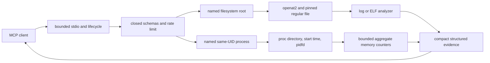

# Native MCP Sandbox

> A security-first, resource-bounded C++20 server for local AI-agent evidence tools.

Native MCP Sandbox gives an MCP client narrow, read-only access to selected Linux
evidence without exposing a shell, unrestricted filesystem browser, or raw process
memory. The project is built in small auditable phases: protocol handling, filesystem
containment, bounded log analysis, non-executing ELF inspection, and now aggregate
process-memory observation.

## Project status

**Phase 5 — Bounded `/proc` memory observation (`v0.6.0`)**

With no arguments, the executable remains host-isolated and advertises no tools. With a
trusted runtime policy, it exposes only the capabilities explicitly configured:

- `logs.search` — bounded literal search in one approved regular file;
- `logs.tail` — bounded previews of final logical lines;
- `elf.inspect` — bounded structural metadata from one approved ELF file; and
- `proc.memory` — aggregate memory counters for one named same-UID process.

The MCP client never supplies an absolute target path or raw PID. It selects an
operator-defined filesystem root or process alias.

## Runtime policy

Schema version 1 remains accepted unchanged for filesystem-only operation:

```json
{
  "version": 1,
  "roots": [
    {
      "name": "evidence",
      "path": "/srv/approved-evidence",
      "maxFileBytes": 16777216
    }
  ]
}
```

Schema version 2 adds an exact `processes` array. Either array may be empty, but at least
one capability must be configured:

```json
{
  "version": 2,
  "roots": [
    {
      "name": "evidence",
      "path": "/srv/approved-evidence",
      "maxFileBytes": 16777216
    }
  ],
  "processes": [
    {
      "name": "server",
      "pid": "self"
    },
    {
      "name": "worker",
      "pid": 12345
    }
  ]
}
```

Start the configured server:

```bash
./build/dev/native-mcp-sandbox --policy-config ./policy.json
```

Strict mode requires Linux `openat2` for filesystem targets and `pidfd_open` for process
identity. On an older kernel, startup fails closed unless the relevant compatibility
flag is explicitly supplied:

```bash
./build/dev/native-mcp-sandbox \
  --policy-config ./policy.json \
  --allow-legacy-descriptor-walk \
  --allow-legacy-process-pinning
```

Compatibility modes print a warning to stderr. Legacy filesystem walking cannot prove
every bind-mount boundary. Legacy process pinning retains the `/proc/<pid>` directory
and revalidates process start time, but does not claim pidfd-backed lifetime pinning.

## Filesystem tools

All filesystem targets pass through the descriptor-based policy gate. Strict mode uses
`RESOLVE_BENEATH`, `RESOLVE_NO_SYMLINKS`, `RESOLVE_NO_MAGICLINKS`, and
`RESOLVE_NO_XDEV`. Only bounded regular files become readable.

### `logs.search`

Required arguments are `root`, `path`, and a literal `query` of 1–256 bytes. Optional
`caseSensitive` defaults to `true`; `false` folds ASCII letters only. Optional
`maxMatches` is 1–50 and defaults to 20. Matching streams in 8 KiB chunks and can cross
a chunk boundary without loading the complete file.

### `logs.tail`

Required arguments are `root` and `path`. Optional `maxLines` is 1–50 and defaults to
20. The analyzer scans incrementally, retains only the requested final bounded previews,
and marks long lines whose beginning was discarded.

### `elf.inspect`

Required arguments are `root` and `path`. The target is never executed, dynamically
loaded, relocated, or memory-mapped. The analyzer reads selected ELF32 or ELF64 metadata
with bounded `pread` operations and reports identity, interpreter, dependencies, GNU
build ID when present in a program note, bounded segment summaries, and structural
stack, RELRO, PIE-like, and writable-executable indicators. These fields are
observations, not a safety or malware verdict.

## `proc.memory`

Required input:

```json
{"process":"server"}
```

The alias must have been declared by the operator in a version-2 policy. At startup the
server:

1. restricts the target to the server's effective UID;
2. opens and retains `/proc/<pid>` as a directory descriptor;
3. records field 22 (`starttime`) from `/proc/<pid>/stat`; and
4. obtains a pidfd in strict mode.

Identity is checked again before and after each observation. A process exit or identity
change produces a bounded tool error instead of silently following a reused PID.

The tool reads only fixed pseudo-files beneath the pinned process directory:

- `status` for selected virtual, resident, anonymous, file-backed, shared, stack,
  executable, library, page-table, swap, and huge-page counters;
- `statm` for page-based virtual, resident, shared, text, and data-plus-stack totals; and
- optional `smaps_rollup` for aggregate RSS, PSS, sharing, anonymous, swap, and locked
  memory.

It never reads `/proc/<pid>/mem`, `maps`, `smaps`, `pagemap`, `cmdline`, `environ`, or
`fd`. `smaps_rollup` may be absent or denied; the result reports that condition rather
than falling back to a more invasive source. The counters are non-atomic snapshots, and
Linux documents some `statm` values as approximate.

## Fixed limits

| Boundary | Limit |
| --- | ---: |
| Runtime policy text | 64 KiB |
| Filesystem roots | 16 |
| Process aliases | 16 |
| Process `stat` read | 8 KiB |
| Process `status` read | 64 KiB |
| Process `statm` read | 4 KiB |
| Process `smaps_rollup` read | 256 KiB |
| Log scan | 16 MiB |
| Log read chunk | 8 KiB |
| Log preview source bytes | 512 per returned line |
| Search matches or tail lines | 50 |
| ELF selected metadata reads | 1 MiB |
| ELF program headers | 256 |
| ELF dynamic entries | 4096 |
| ELF dynamic string table | 256 KiB |
| Tool-call burst | 16 calls per one-second window |
| JSON-RPC request and response | 1 MiB each |

## MCP behavior

The server targets MCP revision `2025-11-25` over newline-delimited JSON-RPC 2.0 on
stdin/stdout. It supports `initialize`, `notifications/initialized`, `ping`,
`tools/list`, and—in configured mode—`tools/call`.

Tool definitions have closed input schemas, success output schemas, read-only
annotations, and forbidden task support. Successful calls return matching
`structuredContent` and text content. Expected execution failures use `isError` and do
not claim conformance to a success-only output schema. Unknown tools and malformed call
envelopes are JSON-RPC errors.

Stdout contains only complete protocol messages. Generic diagnostics and explicit
legacy-mode warnings go to stderr without echoing request, file, or process contents.

## Reproducible unconfigured transcript

```bash
./build/dev/native-mcp-sandbox <<'MCP_INPUT'
{"jsonrpc":"2.0","id":1,"method":"initialize","params":{"protocolVersion":"2025-11-25","capabilities":{},"clientInfo":{"name":"demo-client","version":"1.0"}}}
{"jsonrpc":"2.0","method":"notifications/initialized"}
{"jsonrpc":"2.0","id":2,"method":"ping"}
{"jsonrpc":"2.0","id":3,"method":"tools/list"}
MCP_INPUT
```

Expected stdout:

```jsonl
{"id":1,"jsonrpc":"2.0","result":{"capabilities":{"tools":{}},"protocolVersion":"2025-11-25","serverInfo":{"name":"native-mcp-sandbox","version":"0.6.0"}}}
{"id":2,"jsonrpc":"2.0","result":{}}
{"id":3,"jsonrpc":"2.0","result":{"tools":[]}}
```

The initialized notification receives no response, and this normal transcript writes
nothing to stderr. Process integration tests also launch configured filesystem-only,
process-only, and combined servers.

## Build and verify

Requirements: Linux, CMake 3.20+, Ninja, a C++20 GCC or Clang compiler,
system-provided nlohmann/json 3.11+, Linux `openat2` and ELF headers, procfs, and a
kernel with pidfd support for strict process mode. No libelf or procps runtime dependency
is used.

```bash
cmake --preset dev
cmake --build --preset dev
ctest --preset dev

cmake --preset release
cmake --build --preset release
ctest --preset release

cmake --preset sanitizers
cmake --build --preset sanitizers
ctest --preset sanitizers
```

Presets treat warnings as errors and use at most two compilation jobs.

## Architecture



## Deliberate limitations

Phase 5 does not provide regex, recursive search, file watching, arbitrary file reads,
filesystem mutation, shell execution, networking, ELF sections or symbols, disassembly,
signature verification, raw process memory, memory maps, command lines, environments,
process discovery, worker scheduling, cancellation, or hard per-call deadlines.
Processing remains synchronous. These omissions are explicit rather than hidden behind
security claims.

## Roadmap

1. Phase 0 — foundation, constraints, build, tests, and CI: complete
2. Phase 1 — minimal MCP lifecycle and JSON-RPC over stdio: complete
3. Phase 2 — filesystem policy gate and resource enforcement: complete
4. Phase 3 — streaming log-analysis tools: complete
5. Phase 4 — safe Linux ELF inspection: complete
6. Phase 5 — bounded `/proc` memory observation: complete
7. Phase 6 — coroutine orchestration, cancellation, and backpressure
8. Phase 7 — fuzzing, sanitizer coverage, and security regression suite
9. Phase 8 — deterministic agent investigation demonstration
10. Phase 9 — reproducible benchmarks and reference comparison
11. Phase 10 — release hardening and stable tool interface

## Repository layout

```text
include/native_mcp/runtime_config.hpp     Versioned runtime-policy parser
src/runtime_config.cpp                    Closed schema v1/v2 parsing
include/native_mcp/process_memory.hpp     Process policy and aggregate-memory API
src/process_memory.cpp                    Same-UID identity pinning and bounded proc reads
include/native_mcp/file_policy.hpp        Filesystem policy and owned descriptors
src/file_policy.cpp                       Linux path containment and regular-file checks
include/native_mcp/log_analysis.hpp       Streaming log-analysis API
src/log_analysis.cpp                      Literal search and bounded tail
include/native_mcp/elf_analysis.hpp       Bounded ELF inspection API
src/elf_analysis.cpp                      Selected ELF metadata parsing
tests/process_memory_tests.cpp            Process config, identity, and observation tests
```

## License

Apache License 2.0. See [`LICENSE`](LICENSE).
