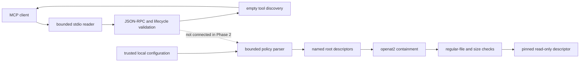

# Native MCP Sandbox

> A security-first, resource-bounded C++20 foundation for local AI-agent analysis tools.

Native MCP Sandbox explores how an AI agent can inspect selected local Linux evidence
without receiving unrestricted host access. The project is built in narrow, auditable
phases: protocol handling first, policy enforcement before host access, and analysis
tools only after their security boundaries are testable.

## Project status

**Phase 2 — Filesystem policy gate (`v0.3.0`)**

The executable still exposes only the Phase 1 MCP lifecycle over stdin/stdout. Tool
discovery intentionally returns an empty list, and `tools/call` is not implemented.
Phase 2 adds a separate C++ policy library that can safely open approved regular files
for later tools without making that capability reachable through MCP yet.

| Available now | Deliberately not available yet |
| --- | --- |
| Bounded JSON-RPC 2.0 over stdio | `tools/call` |
| MCP initialization, ping, and empty tool discovery | Log or ELF analysis |
| Named read-only filesystem roots | Process observation |
| Strict relative-path validation | Network listening or HTTP |
| Symlink and traversal denial | Coroutines, workers, or cancellation |
| Regular-file and size enforcement | Performance claims |
| Kernel-enforced mount containment on modern Linux | OS namespaces or seccomp |

## Filesystem policy boundary

A policy configuration has a bounded schema:

```json
{
  "version": 1,
  "roots": [
    {
      "name": "logs",
      "path": "/var/log/my-application",
      "maxFileBytes": 16777216
    }
  ]
}
```

The parser rejects malformed JSON, unknown fields, duplicate root names, invalid root
names, non-absolute or non-normalized root paths, too many roots, oversized
configuration text, and invalid file limits.

A request to the library identifies a configured root and a relative path such as
`logs/app.log`. It rejects:

- absolute paths, empty paths, repeated separators, `.` components, and `..` traversal;
- symbolic links in any component;
- magic links and mount crossings when `openat2` is available;
- directories, FIFOs, sockets, devices, and other non-regular targets;
- missing or unreadable files; and
- files larger than the selected root's limit.

The returned descriptor is pinned to the checked inode before it becomes readable.
Later phases must still stop reading at `max_read_bytes`, because another process can
grow an already-open regular file.

## Linux guarantees and compatibility

Strict mode uses Linux `openat2` with `RESOLVE_BENEATH`, `RESOLVE_NO_SYMLINKS`,
`RESOLVE_NO_MAGICLINKS`, and `RESOLVE_NO_XDEV`. This delegates containment to the
kernel and rejects path-resolution races rather than trying to prove safety from text
normalization alone.

On kernels without `openat2`, policy construction fails closed by default. An explicit
`allow_legacy_descriptor_walk` option exists for controlled compatibility testing. It
walks one component at a time using pinned directory descriptors and `O_NOFOLLOW`, so
it still rejects traversal and symlinks without time-of-check/time-of-use gaps. It
cannot reliably detect every same-filesystem bind mount and is therefore not the
default security mode.

The readable descriptor is reopened from the already pinned regular-file descriptor
through `/proc/self/fd`. If procfs is unavailable or permission checks fail, the
operation is denied.

## Protocol behavior

The MCP server continues to:

- read one JSON-RPC message per input line;
- write only complete protocol response lines to stdout;
- send generic diagnostics to stderr without echoing request contents;
- enforce 1 MiB request and response limits;
- validate MCP revision `2025-11-25` and lifecycle ordering;
- support `initialize`, `notifications/initialized`, `ping`, and empty `tools/list`;
- reject batching and fractional IDs; and
- exit successfully on EOF.

No filesystem policy object is created from MCP input in Phase 2.

## Try the protocol

```bash
./build/dev/native-mcp-sandbox <<'EOF'
{"jsonrpc":"2.0","id":1,"method":"initialize","params":{"protocolVersion":"2025-11-25","capabilities":{},"clientInfo":{"name":"demo-client","version":"1.0"}}}
{"jsonrpc":"2.0","method":"notifications/initialized"}
{"jsonrpc":"2.0","id":2,"method":"ping"}
{"jsonrpc":"2.0","id":3,"method":"tools/list"}
EOF
```

Expected stdout:

```jsonl
{"id":1,"jsonrpc":"2.0","result":{"capabilities":{"tools":{}},"protocolVersion":"2025-11-25","serverInfo":{"name":"native-mcp-sandbox","version":"0.3.0"}}}
{"id":2,"jsonrpc":"2.0","result":{}}
{"id":3,"jsonrpc":"2.0","result":{"tools":[]}}
```

The initialized notification receives no response. The normal transcript writes
nothing to stderr.

## Build and verify

### Requirements

- Linux
- CMake 3.20 or newer
- Ninja
- A C++20-capable GCC or Clang compiler
- system-provided nlohmann/json 3.11 or newer
- Linux headers providing `openat2`

On EndeavourOS/Arch Linux, install the `nlohmann-json` package. CMake does not download
or vendor dependencies.

```bash
cmake --preset dev -DNMS_WARNINGS_AS_ERRORS=ON
cmake --build --preset dev
ctest --preset dev

cmake --preset sanitizers
cmake --build --preset sanitizers
ctest --preset sanitizers
```

The presets use at most two compilation jobs. Docker and a local language model are
not required.

## Architecture



The separation is intentional: the security boundary is implemented and tested before
an agent-facing log tool can call it.

## Roadmap

1. **Phase 0:** foundation, constraints, build, tests, and CI — complete
2. **Phase 1:** minimal MCP lifecycle and JSON-RPC-over-stdio — complete
3. **Phase 2:** filesystem policy gate and resource enforcement — current
4. **Phase 3:** streaming log-analysis tools
5. **Phase 4:** safe Linux ELF inspection
6. **Phase 5:** bounded `/proc` memory observation
7. **Phase 6:** coroutine orchestration, cancellation, and backpressure
8. **Phase 7:** fuzzing, sanitizer coverage, and security regression suite
9. **Phase 8:** deterministic agent investigation demonstration
10. **Phase 9:** reproducible benchmarks and reference comparison
11. **Phase 10:** release hardening and stable tool interface

## Repository layout

```text
.
├── include/native_mcp/file_policy.hpp   Filesystem policy API and owned descriptors
├── src/file_policy.cpp                  Linux path containment and file checks
├── tests/file_policy_tests.cpp          Adversarial policy tests
├── include/native_mcp/                  Foundation and protocol interfaces
├── src/                                 Foundation, protocol, policy, and executable
├── tests/                               Unit and process-level tests
├── docs/adr/                            Architecture decisions
├── PHASE_2_MANIFEST.md                  Phase scope and expected source tree
├── SECURITY.md                          Vulnerability reporting
└── THREAT_MODEL.md                      Assets, adversaries, controls, limitations
```

## License

Licensed under the Apache License 2.0. See [`LICENSE`](LICENSE).
