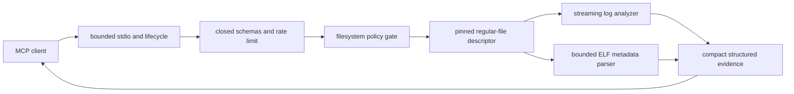

# Native MCP Sandbox

> A security-first, resource-bounded C++20 server for local AI-agent evidence tools.

Native MCP Sandbox gives an MCP client narrow, read-only access to selected Linux
evidence without exposing a shell or unrestricted filesystem browser. The project is
built in small auditable phases: protocol handling, filesystem containment, bounded log
analysis, and now non-executing ELF inspection.

## Project status

**Phase 4 — Safe Linux ELF inspection (`v0.5.0`)**

With no arguments, the executable remains a host-isolated MCP lifecycle server and
advertises no tools. When started with a trusted policy configuration, it exposes three
read-only tools:

- `logs.search` — literal byte-sequence search in one approved regular file;
- `logs.tail` — bounded previews of the final logical lines in one approved file; and
- `elf.inspect` — bounded structural metadata from one approved ELF file.

All three tools open files only through the descriptor-based policy gate. They do not
accept absolute target paths, execute shell commands, use the network, mutate files, or
follow symbolic links.

## Security boundary

An operator starts the server with a bounded policy file:

```json
{
  "version": 1,
  "roots": [
    {
      "name": "evidence",
      "path": "/srv/approved-evidence",
      "maxFileBytes": 16777216
    }
  ]
}
```

Start the configured server:

```bash
./build/dev/native-mcp-sandbox --policy-config ./policy.json
```

Strict mode requires Linux `openat2`. It resolves targets beneath a pinned root with
`RESOLVE_BENEATH`, `RESOLVE_NO_SYMLINKS`, `RESOLVE_NO_MAGICLINKS`, and
`RESOLVE_NO_XDEV`. Only regular files within the configured size limit become readable.
The checked inode is reopened through `/proc/self/fd` and revalidated before use.

On an older kernel, startup fails closed. `--allow-legacy-descriptor-walk` is an
explicit compatibility option for controlled environments. It still rejects traversal
and symlinks using pinned directory descriptors, but it cannot prove every bind-mount
boundary and prints a warning to stderr.

The policy configuration is trusted operator input. Tool arguments and inspected file
contents remain untrusted.

## Phase 4 tools

### `logs.search`

Required arguments are `root`, `path`, and a nonempty literal `query` of at most 256
bytes. Optional `caseSensitive` defaults to `true`; `false` folds ASCII letters only.
Optional `maxMatches` is 1–50 and defaults to 20.

The implementation uses streaming Knuth–Morris–Pratt matching, so a match may cross an
8 KiB read boundary without loading the full file. At most one result is returned per
matching line, using the first occurrence. Each result contains a one-based line number,
absolute byte offset, bounded escaped preview, and truncation flags.

### `logs.tail`

Required arguments are `root` and `path`. Optional `maxLines` is 1–50 and defaults to
20. The implementation scans incrementally and retains only the requested final
bounded previews. Very long lines retain their end and report that the beginning was
truncated.

### `elf.inspect`

Required arguments are `root` and `path`. The file is never executed, loaded, relocated,
or memory-mapped. The analyzer uses bounded `pread` calls against the pinned descriptor
and supports:

- ELF32 and ELF64;
- little- and big-endian files;
- file type, machine, OS ABI, and entry point;
- bounded program-segment summaries;
- the program interpreter;
- `DT_NEEDED` library names;
- a GNU build ID from a bounded `PT_NOTE`, when present; and
- structural stack, RELRO, PIE, and writable-executable segment indicators.

The hardening fields are observations, not a guarantee that a binary is safe. Unusual
extended program-header numbering, duplicate interpreter or dynamic segments,
out-of-range offsets, unterminated strings, and oversized metadata fail explicitly.

### Fixed limits

| Boundary | Limit |
| --- | ---: |
| Log scan | 16 MiB |
| Log read chunk | 8 KiB |
| Log preview source bytes | 512 per returned line |
| Search query | 256 bytes |
| Search matches | 50 |
| Tail lines | 50 |
| ELF metadata reads | 1 MiB |
| ELF program headers | 256 |
| ELF dynamic entries | 4096 |
| ELF dynamic string table | 256 KiB |
| ELF needed libraries | 64 |
| ELF note data | 256 KiB |
| ELF segment summaries | 64 |
| Tool-call burst | 16 calls per one-second window |
| JSON-RPC request and response | 1 MiB each |

File size is captured when the policy opens the descriptor. Log growth does not expand
the read budget. ELF inspection also compares descriptor identity and file metadata
around parsing and reports a detected change. Binary and non-printable output bytes are
escaped so responses remain compact valid JSON.

## MCP behavior

The server targets MCP revision `2025-11-25` over newline-delimited JSON-RPC 2.0 on
stdin/stdout. It supports `initialize`, `notifications/initialized`, `ping`,
`tools/list`, and—only in configured mode—`tools/call`.

Tool definitions include closed input schemas, success output schemas, read-only
annotations, and forbidden task support. Successful calls return matching
`structuredContent` and serialized text content. Tool execution errors use `isError`
and text content without claiming conformance to the success output schema. Unknown
tools and malformed call envelopes are protocol errors.

Stdout contains only complete protocol messages. Generic diagnostics and the explicit
legacy-mode warning go to stderr without echoing request or inspected-file contents.

## Reproducible unconfigured transcript

```bash
./build/dev/native-mcp-sandbox <<'MCP_INPUT'
{"jsonrpc":"2.0","id":1,"method":"initialize","params":{"protocolVersion":"2025-11-25","capabilities":{},"clientInfo":{"name":"demo-client","version":"1.0"}}}
{"jsonrpc":"2.0","method":"notifications/initialized"}
{"jsonrpc":"2.0","id":2,"method":"ping"}
{"jsonrpc":"2.0","id":3,"method":"tools/list"}
MCP_INPUT
```

Expected stdout:

```jsonl
{"id":1,"jsonrpc":"2.0","result":{"capabilities":{"tools":{}},"protocolVersion":"2025-11-25","serverInfo":{"name":"native-mcp-sandbox","version":"0.5.0"}}}
{"id":2,"jsonrpc":"2.0","result":{}}
{"id":3,"jsonrpc":"2.0","result":{"tools":[]}}
```

The initialized notification receives no response, and this normal transcript writes
nothing to stderr. Process integration tests compare this output exactly and also
launch a configured server to call all three tools.

## Build and verify

Requirements: Linux, CMake 3.20+, Ninja, a C++20 GCC or Clang compiler,
system-provided nlohmann/json 3.11+, and Linux headers providing `openat2` and ELF
constants. No libelf dependency, Docker environment, or local language model is
required.

On EndeavourOS or Arch Linux, install `nlohmann-json`; CMake does not fetch dependencies.

```bash
cmake --preset dev
cmake --build --preset dev
ctest --preset dev

cmake --preset sanitizers
cmake --build --preset sanitizers
ctest --preset sanitizers
```

Presets use at most two compilation jobs.

## Architecture



## Deliberate limitations

Phase 4 does not provide regex, recursive directory search, file watching, arbitrary
file reads, filesystem mutation, shell execution, networking, ELF sections or symbols,
disassembly, malware classification, signature verification, process observation,
worker scheduling, cancellation, or hard per-call deadlines. ELF GNU build IDs are read
from program notes, not section-only notes. Processing remains synchronous. The
optional legacy path backend has incomplete bind-mount detection.

These limitations are explicit rather than hidden behind security claims.

## Roadmap

1. Phase 0 — foundation, constraints, build, tests, and CI: complete
2. Phase 1 — minimal MCP lifecycle and JSON-RPC over stdio: complete
3. Phase 2 — filesystem policy gate and resource enforcement: complete
4. Phase 3 — streaming log-analysis tools: complete
5. Phase 4 — safe Linux ELF inspection: complete
6. Phase 5 — bounded `/proc` memory observation
7. Phase 6 — coroutine orchestration, cancellation, and backpressure
8. Phase 7 — fuzzing, sanitizer coverage, and security regression suite
9. Phase 8 — deterministic agent investigation demonstration
10. Phase 9 — reproducible benchmarks and reference comparison
11. Phase 10 — release hardening and stable tool interface

## Repository layout

```text
include/native_mcp/elf_analysis.hpp   Bounded ELF inspection API
src/elf_analysis.cpp                  ELF format validation and selected metadata parsing
include/native_mcp/tool_service.hpp   MCP tool schemas and dispatch
src/tool_service.cpp                  Policy-gated log and ELF tool execution
tests/elf_analysis_tests.cpp          Synthetic, malformed, and real-ELF tests
include/native_mcp/file_policy.hpp    Filesystem policy API and owned descriptors
src/file_policy.cpp                   Linux path containment and file checks
include/native_mcp/log_analysis.hpp   Streaming log-analysis API
src/log_analysis.cpp                  Literal search and bounded tail
```

## License

Apache License 2.0. See [`LICENSE`](LICENSE).
