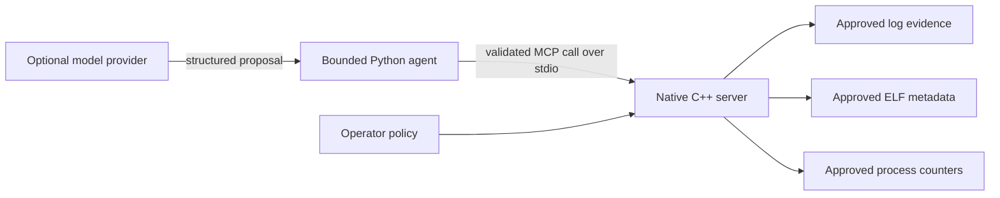

# Native MCP Sandbox

**A C++20 MCP server that exposes narrow, read-only Linux evidence through an explicit operator
policy, plus a separate bounded Python investigation agent.**

[](https://github.com/kabbersokhi-boop/native-mcp-sandbox/actions/workflows/ci.yml)
[](https://github.com/kabbersokhi-boop/native-mcp-sandbox/releases/latest)
[](CMakeLists.txt)
[](https://www.kernel.org/)
[](LICENSE)

> **Boundary:** this is a capability-bounded evidence server. It is not a process, container, or
> kernel sandbox.

## Security question

How can an AI-assisted investigation inspect useful host evidence without receiving a shell,
arbitrary filesystem access, process discovery, raw memory, or network authority inside the
native server?

This project answers with a small MCP tool surface:

- the operator maps symbolic names to approved files and processes;
- the client selects a symbolic name, never a raw path or PID;
- the server bounds input, output, work, memory, and time;
- strict Linux modes use descriptor-based containment and pinned process identity;
- the native process communicates only through JSON-RPC over standard input and output;
- an optional external agent can propose calls, but local code validates and executes them.

Without a trusted runtime policy, the server advertises no host tools.

## Trust boundaries



The native server has no provider SDK, credential, or network client. The external agent captures
the exact MCP tool surface, validates each proposal against closed schemas, derives a stable action
identity, and executes calls serially with replay protection.

The external agent remains a preview surface. Treat release evidence for the native server and
cross-language agent/server compatibility as separate claims, and validate both at the exact
commit you deploy.

The current release is `v0.11.0`. Its tag identifies the recorded native-server and preview-agent
source; [the assurance record](docs/ASSURANCE.md) states which checks apply to each boundary.

## Read-only tools

| Tool | Purpose | Boundary |
| --- | --- | --- |
| `logs.search` | Search one approved log for literal text | No recursive search or client path |
| `logs.tail` | Read bounded previews of final log lines | No watch mode or unbounded output |
| `elf.inspect` | Parse selected ELF32/ELF64 metadata | Never executes or loads the target |
| `proc.memory` | Read aggregate counters for one named process | No raw memory, maps, command line, environment, or discovery |

Strict filesystem access uses Linux `openat2` with beneath-root, no-symlink, no-magic-link, and
no-mount-crossing constraints. Strict process access combines same-UID validation, procfs
start-time checks, and pidfd identity pinning. Compatibility modes are explicit opt-ins with
documented limitations.

## Build and test

Requirements: Linux, CMake 3.20 or newer, Ninja, GCC or Clang with C++20 support, Python 3, and
nlohmann/json 3.11 or newer.

```bash
sudo apt-get update
sudo apt-get install --yes build-essential cmake ninja-build nlohmann-json3-dev python3

git clone https://github.com/kabbersokhi-boop/native-mcp-sandbox.git
cd native-mcp-sandbox
cmake --preset dev
cmake --build --preset dev
ctest --preset dev --output-on-failure
```

Check the binary:

```bash
./build/dev/native-mcp-sandbox --version
./build/dev/native-mcp-sandbox --self-check
```

## Configure the server

```json
{
  "version": 2,
  "roots": [
    {
      "name": "evidence",
      "path": "/srv/approved-evidence",
      "maxFileBytes": 16777216
    }
  ],
  "processes": [
    {
      "name": "server",
      "pid": "self"
    }
  ]
}
```

```bash
./build/dev/native-mcp-sandbox --policy-config ./policy.json
```

The server uses newline-delimited JSON-RPC 2.0 over standard input and output and targets MCP
revision `2025-11-25`.

## Reproduce the investigation

The primary demo uses the real native server, synthetic evidence, and canonical reports. It needs
no model provider, credential, or internet connection.

```bash
mkdir -p build/agent-investigation-output
python3 scripts/run_agent_investigation_demo.py \
  --server ./build/dev/native-mcp-sandbox \
  --fixture ./demo/investigation/application.log \
  --output-dir ./build/agent-investigation-output
```

The command produces `report.json` and `report.md`. Validation covers MCP lifecycle, exact tool
surface, response correlation, provenance, and byte-identical report generation. Committed
reference output is available in [`demo/investigation/`](demo/investigation/).

## Assurance strategy

| Layer | Evidence |
| --- | --- |
| Protocol and integration | JSON-RPC lifecycle, runtime policy, tools, and a real stdio process |
| Negative and adversarial | Malformed JSON, duplicate keys, oversized input, replay, fabricated evidence, and transcript tampering |
| Memory safety | ASan, UBSan, leak checks, and focused ThreadSanitizer runs |
| Fuzzing | Fixed-seed campaigns and coverage-guided parser targets |
| Determinism | Repeated canonical transcript and report equality |
| Provider isolation | Loopback fake HTTP, TLS and endpoint policy, credential handling, and synthetic-egress checks |

Release-specific commands, environments, counts, and limitations belong in
[`docs/ASSURANCE.md`](docs/ASSURANCE.md), not in the product claims on this page.

## Code tour

| Area | Path |
| --- | --- |
| MCP lifecycle and scheduling | [`src/server.cpp`](src/server.cpp), [`src/orchestration.cpp`](src/orchestration.cpp) |
| Runtime authority policy | [`src/runtime_config.cpp`](src/runtime_config.cpp), [`src/file_policy.cpp`](src/file_policy.cpp) |
| Evidence tools | [`src/log_analysis.cpp`](src/log_analysis.cpp), [`src/elf_analysis.cpp`](src/elf_analysis.cpp), [`src/process_memory.cpp`](src/process_memory.cpp) |
| External agent | [`agent/native_mcp_agent/`](agent/native_mcp_agent/) |
| Adversarial and integration tests | [`tests/`](tests/) |
| Fuzz targets | [`fuzz/`](fuzz/) |
| Architecture decisions | [`docs/adr/`](docs/adr/) |

Read [Architecture](ARCHITECTURE.md), [Threat Model](THREAT_MODEL.md), [Security Policy](SECURITY.md),
and [Engineering Highlights](docs/ENGINEERING_HIGHLIGHTS.md) before changing an authority boundary.

Licensed under the [Apache License 2.0](LICENSE).
