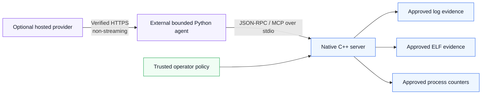

# Native MCP Sandbox

> A security-first C++20 MCP server and bounded investigation agent for narrow, read-only Linux evidence access.

[](https://github.com/kabbersokhi-boop/native-mcp-sandbox/actions/workflows/ci.yml)
[](https://github.com/kabbersokhi-boop/native-mcp-sandbox/tags)
[](LICENSE)
[](https://en.cppreference.com/w/cpp/20)
[](https://www.python.org/)
[](https://www.kernel.org/)
[](#project-status)

Native MCP Sandbox explores one practical question:

**How can an AI agent inspect useful host evidence without receiving a shell, arbitrary filesystem access, raw process memory, networking inside the native server, or broad operating-system authority?**

The project answers with two deliberately separate components:

1. a small native MCP server that exposes only operator-approved, read-only tools over stdio; and
2. an optional external Python agent that can use a bounded OpenAI-compatible provider while preserving local validation, authorization, replay protection and evidence provenance.

Version `v0.11.0` packages the completed roadmap through Phase 10.4: the native server and the separate bounded agent are deliberately different trust boundaries.

## Why this project exists

Many agent integrations begin with a powerful primitive such as a shell, a filesystem browser, a general process API or unrestricted network access. That is convenient, but it creates a large trust boundary.

Native MCP Sandbox takes the opposite approach:

- expose a small set of purpose-built tools;
- require an explicit operator policy;
- use symbolic resource names instead of client-selected paths or PIDs;
- bound input, output, work, memory and time;
- treat protocol, provider and evidence data as untrusted;
- fail closed when strict controls are unavailable;
- retain reproducible tests and public verification evidence.

It is intended as:

- a reference implementation for narrow MCP tool design;
- a portfolio-quality systems-security project;
- a reproducible study of Linux descriptor and process-identity controls;
- a foundation for bounded agent interoperability experiments.

It is **not** a remote-administration framework, a shell replacement, an autonomous incident-response product or proof that all vulnerabilities are absent.

## What makes the engineering interesting

| Design choice | Why it matters |
| --- | --- |
| Symbolic policy aliases | A client chooses an operator-defined name, never a raw path or PID. |
| `openat2` + retained descriptors | Strict filesystem access stays beneath an approved root and resists traversal, symlink, magic-link and mount-crossing escape attempts. |
| pidfd + start-time verification | Strict process mode pins a named process identity rather than trusting a reusable numeric PID. |
| Bounded JSON and closed schemas | Byte, token and nesting budgets are checked before work is admitted; unknown fields and duplicate keys fail closed. |
| Fixed workers and C++20 coroutines | Admission, cancellation, steady-clock deadlines and serialized output are explicit rather than left to unbounded background work. |
| Separate agent authority | A hosted model can propose a call, but local code validates the captured tool surface, derives a stable action identity and executes serially at most once. |
| Provider isolation | Networking and credentials exist only in the opt-in external agent; the native server stays stdio-only. |

The rationale, tradeoffs and code-level evidence are collected in [`docs/ENGINEERING_HIGHLIGHTS.md`](docs/ENGINEERING_HIGHLIGHTS.md).

## At a glance

| Component | Responsibility | Security boundary |
| --- | --- | --- |
| Native C++ MCP server | Validates MCP lifecycle and exposes approved Linux evidence tools | stdio-only, network-free, credential-free |
| Runtime policy | Maps symbolic names to approved roots and processes | operator-controlled; no client-selected raw authority |
| External Python agent | Captures the exact tool surface, validates proposals and executes serially | bounded, replay-resistant and at-most-once |
| Optional provider adapter | Maps provider-neutral requests to OpenAI-compatible non-streaming HTTPS | configurable, credential-isolated and synthetic-only |
| Deterministic fixtures | Exercise provider, MCP, timeout, retry and adversarial paths | offline and credential-free |

## Security boundary

The native server intentionally does **not** provide:

- a shell;
- arbitrary file reads or recursive filesystem search;
- filesystem mutation;
- raw process memory;
- process maps, command lines, environments or file descriptors;
- process discovery or control;
- native-server networking;
- provider credentials inside the native process;
- model-defined MCP methods or tools.

Without a trusted runtime policy, the server advertises no host tools.

Strict filesystem mode uses Linux `openat2` containment. Strict process mode requires same-UID validation and pidfd-backed identity pinning. Compatibility modes are explicit opt-ins with documented limitations.

See [`SECURITY.md`](SECURITY.md) and [`THREAT_MODEL.md`](THREAT_MODEL.md) before changing any authority boundary.

## Architecture



The provider never executes a tool directly. It can only propose a tool call. The external agent validates each proposal against the exact captured tool surface and the local closed schema before constructing a fixed `tools/call` request.

MCP execution is serial. Stable local action identities, duplicate detection and replay state enforce at-most-once execution within a bounded investigation.

See [`ARCHITECTURE.md`](ARCHITECTURE.md) for lifecycle, scheduling, containment, cancellation and shutdown details.

## Read-only tools

A trusted policy can enable four tools.

| Tool | Purpose | Important boundary |
| --- | --- | --- |
| `logs.search` | Search one approved log file for literal text | no recursive search or arbitrary paths |
| `logs.tail` | Read bounded previews of final log lines | no file watching or unbounded output |
| `elf.inspect` | Inspect selected ELF32/ELF64 metadata | the target is never executed or loaded |
| `proc.memory` | Read bounded aggregate memory counters for one named process | no raw memory, maps, command line, environment or discovery |

## Quick start

### Requirements

- Linux
- CMake 3.20 or newer
- Ninja
- GCC or Clang with C++20 support
- Python 3
- nlohmann/json 3.11 or newer
- procfs
- Linux `openat2` and pidfd support for strict modes

Ubuntu example:

```bash
sudo apt-get update
sudo apt-get install --yes build-essential cmake ninja-build nlohmann-json3-dev python3
```

### Build and test

```bash
git clone https://github.com/kabbersokhi-boop/native-mcp-sandbox.git
cd native-mcp-sandbox

cmake --preset dev
cmake --build --preset dev
ctest --preset dev --output-on-failure
```

Check the executable:

```bash
./build/dev/native-mcp-sandbox --version
./build/dev/native-mcp-sandbox --self-check
```

## Configure the native server

The runtime policy maps symbolic names to approved resources. The client selects the symbolic name, not the raw path or PID.

Example policy:

```json
{
  "version": 2,
  "roots": [
    {
      "name": "evidence",
      "path": "/srv/approved-evidence",
      "maxFileBytes": 16777216
    }
  ],
  "processes": [
    {
      "name": "server",
      "pid": "self"
    }
  ]
}
```

Start the configured server:

```bash
./build/dev/native-mcp-sandbox --policy-config ./policy.json
```

The server uses newline-delimited JSON-RPC 2.0 over standard input and standard output and targets MCP revision `2025-11-25`.

## Demonstration

### Deterministic offline investigation

The primary demo uses the real native server, synthetic evidence and canonical reports. It needs no provider, credential or internet connection.

```bash
mkdir -p build/agent-investigation-output

python3 scripts/run_agent_investigation_demo.py \
  --server ./build/dev/native-mcp-sandbox \
  --fixture ./demo/investigation/application.log \
  --output-dir ./build/agent-investigation-output
```

It creates:

```text
build/agent-investigation-output/report.json
build/agent-investigation-output/report.md
```

The committed reference outputs are in [`demo/investigation/`](demo/investigation/). The demo validates the MCP lifecycle, exact tool surface, response correlation and byte-identical report generation.

### Optional OpenAI-compatible synthetic smoke

The hosted-provider smoke is manual, disabled by default, synthetic, redacted, observational and non-gating.

```bash
python3 scripts/phase_10_4_openai_smoke.py \
  --enable-synthetic-live \
  --endpoint https://provider.example/v1/chat/completions \
  --model operator-selected-model \
  --credential-env NATIVE_MCP_PROVIDER_TOKEN
```

Do not place a real credential in a command line, committed file or documentation. The credential value is loaded only at explicit production HTTPS execution. The loopback fake-provider path is structurally credential-free.

See [`docs/DEMO.md`](docs/DEMO.md) for the full walkthrough and limitations.

## Testing and proof

The project uses layered verification rather than one headline test count.

| Layer | Examples |
| --- | --- |
| Unit and integration | protocol, runtime policy, tools, real stdio process, strict Linux controls |
| Negative and adversarial | malformed JSON, duplicate keys, oversized input, replay, fabricated evidence, transcript tampering |
| Memory safety | ASan, UBSan and leak-enabled runs |
| Concurrency | focused ThreadSanitizer and scheduler stress |
| Deterministic fuzzing | fixed-seed mutation campaigns |
| Coverage-guided fuzzing | protocol, runtime policy, ELF, log and process parser targets |
| Determinism | repeated canonical transcript and report equality |
| Provider isolation | fake loopback HTTP, TLS/endpoint policy, credential and synthetic-egress tests |

The `v0.11.0` release candidate passed:

- 16 Phase 10.4 tests;
- 34 Phase 10.3 adversarial tests;
- 32 Phase 10.2 orchestration tests;
- 25 Phase 10.1 contract tests plus 10 security regressions;
- 21/21 CTest cases in dev, sanitizer and ThreadSanitizer presets;
- 100,000 deterministic fuzz iterations;
- five 2,000-run libFuzzer smoke campaigns.

The exact reviewed implementation and CI evidence are documented in [`docs/ASSURANCE.md`](docs/ASSURANCE.md).

A clean campaign is evidence for the tested source, environment and paths. It is not proof of complete correctness or security.

## Project status

- Phases 0–10.4: complete at project version `v0.11.0`.
- The native C++ authority is unchanged by Phase 10.
- Phase 11 is not defined.

## Documentation

| Document | Purpose |
| --- | --- |
| [`docs/DEMO.md`](docs/DEMO.md) | Offline and optional hosted-provider demonstrations |
| [`docs/ASSURANCE.md`](docs/ASSURANCE.md) | Test evidence, reproducible commands and proof limitations |
| [`docs/ENGINEERING_HIGHLIGHTS.md`](docs/ENGINEERING_HIGHLIGHTS.md) | Design decisions, tradeoffs and code/test entry points |
| [`docs/RELEASING.md`](docs/RELEASING.md) | Release discipline and tag verification |
| [`ARCHITECTURE.md`](ARCHITECTURE.md) | Protocol, scheduler, containment and agent architecture |
| [`THREAT_MODEL.md`](THREAT_MODEL.md) | Assets, threats, controls and residual risk |
| [`SECURITY.md`](SECURITY.md) | Security policy and vulnerability reporting |
| [`docs/FUZZING.md`](docs/FUZZING.md) | Fuzz targets, campaigns and triage |
| [`CONTRIBUTING.md`](CONTRIBUTING.md) | Contribution and review requirements |
| [`CHANGELOG.md`](CHANGELOG.md) | Notable project changes |
| [`docs/adr/`](docs/adr/) | Architecture decision records |

## Contributing

Contributions are welcome when they preserve the narrow trust boundary and include accepted/rejected-path tests. Open an issue before changing a dependency, protocol, tool, policy gate, scheduler or authority boundary.

Start with [`CONTRIBUTING.md`](CONTRIBUTING.md).

## Security

Please report vulnerabilities through GitHub private vulnerability reporting. Do not publish working exploit details in a public issue.

See [`SECURITY.md`](SECURITY.md).

## License

Apache License 2.0. See [`LICENSE`](LICENSE).
