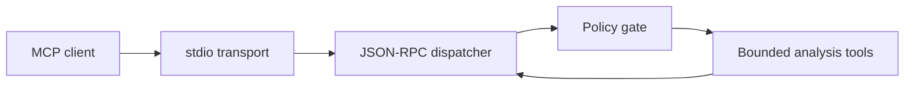

# Native MCP Sandbox

> A security-first, resource-bounded C++20 foundation for local AI-agent analysis tools.

Native MCP Sandbox is an educational, production-minded project exploring how an AI
agent can inspect local evidence without receiving unrestricted access to the host.
The planned server will expose narrowly scoped, read-only tools for streaming log
analysis, Linux ELF inspection, and process-memory observation through the Model
Context Protocol (MCP).

## Project status

**Phase 0 — Foundation (`v0.1.0`)**

This release establishes the build system, resource-budget model, test harness,
architecture, threat model, contribution policy, and continuous integration. It is
intentionally **not yet an MCP server**. Protocol transport begins in Phase 1 after
the security and engineering constraints have been made explicit.

| Available now | Planned and not yet available |
| --- | --- |
| C++20 buildable executable | MCP initialization and tool discovery |
| Conservative resource-budget defaults | JSON-RPC transport over standard I/O |
| Unit and command-level smoke tests | Log, ELF, and memory-analysis tools |
| GCC and Clang CI configuration | C++20 coroutine-based task orchestration |
| Sanitizer-ready build preset | OS-level sandbox hardening |
| Architecture and threat-model documents | Benchmarks and agent investigation demo |

The distinction above is deliberate. Security-sensitive software should make
verifiable claims about current behavior rather than advertise roadmap items as
finished features.

## Why this project exists

Many agent prototypes focus on tool selection while treating the tool runtime as a
trusted black box. This project focuses on that missing systems layer: validating
requests, limiting resources, reducing large local data into useful model context,
and refusing operations outside an explicit policy.

The project is designed to demonstrate the intersection of:

- agent tool and context design;
- modern native C++ engineering;
- bounded concurrency and streaming data processing;
- Linux systems observability; and
- practical security controls with documented limitations.

C++ is used where it has a defensible role: predictable resource ownership,
efficient streaming, direct operating-system integration, and a small native
runtime. The project will measure those properties instead of assuming that a
native implementation is automatically superior.

## Intended user experience

When the tool-bearing phases are complete, an MCP-compatible client should be able
to ask questions such as:

```text
Investigate why the permitted sample service exhausted its memory. Do not modify
files or execute binaries.
```

The agent will be able to search approved logs, inspect an approved ELF file without
running it, sample permitted process-memory information, and correlate the bounded
results. Attempts to escape the configured roots or exceed resource limits should
produce structured denials.

## Security posture

The long-term goal is a **security-conscious local analysis service**, not an
unbreakable security boundary. The design starts with these rules:

- read-only analysis tools;
- no arbitrary command or binary execution;
- explicit filesystem roots and canonical path handling;
- bounded request, response, queue, worker, and execution-time budgets;
- streaming instead of whole-file loading;
- protocol output isolated from diagnostics; and
- testable denials for malicious or accidental misuse.

Application-level validation cannot replace an operating-system sandbox. Linux
namespaces, seccomp, privilege separation, and similar controls are candidates for
later hardening phases and will not be claimed until implemented and tested. See
[`THREAT_MODEL.md`](THREAT_MODEL.md) and [`SECURITY.md`](SECURITY.md).

## Resource profile

The default design target is a modest Linux laptop with 8 GB of RAM. Phase 0 records
the following conservative defaults:

| Budget | Default |
| --- | ---: |
| Maximum request | 1 MiB |
| Maximum response | 1 MiB |
| Pending-request queue | 16 |
| Worker threads | 2 |
| Operation timeout | 30 seconds |

Large benchmarks and extended fuzzing will remain opt-in. Build presets use at most
two parallel compilation jobs.

## Build and verify

### Requirements

- Linux
- CMake 3.20 or newer
- Ninja
- A C++20-capable GCC or Clang compiler

### Development build

```bash
cmake --preset dev
cmake --build --preset dev
ctest --preset dev
./build/dev/native-mcp-sandbox --self-check
```

Expected final line:

```text
self-check passed: request_limit=1048576 response_limit=1048576 queue_limit=16 workers=2 timeout_ms=30000
```

### Sanitizer build

```bash
cmake --preset sanitizers
cmake --build --preset sanitizers
ctest --preset sanitizers
```

### Release build

```bash
cmake --preset release
cmake --build --preset release
ctest --preset release
```

The repository does not require Docker and Phase 0 has no third-party runtime
dependencies.

## Architecture direction

The intended design separates protocol I/O from policy enforcement and analysis:



Only a single response writer will own standard output, preventing concurrent
workers from interleaving protocol messages. Diagnostics will use standard error.
Detailed decisions live in [`ARCHITECTURE.md`](ARCHITECTURE.md) and
[`docs/adr`](docs/adr).

## Roadmap

Each phase is intended to be independently reviewed, tested, and released.

1. **Phase 0:** public foundation, constraints, build, tests, and CI — current
2. **Phase 1:** minimal MCP lifecycle and JSON-RPC-over-stdio transport
3. **Phase 2:** filesystem policy gate and resource enforcement
4. **Phase 3:** streaming log-analysis tools
5. **Phase 4:** safe Linux ELF inspection
6. **Phase 5:** bounded `/proc` memory observation
7. **Phase 6:** coroutine orchestration, cancellation, and backpressure
8. **Phase 7:** fuzzing, sanitizer coverage, and security regression suite
9. **Phase 8:** deterministic agent investigation demonstration
10. **Phase 9:** reproducible benchmarks and reference comparison
11. **Phase 10:** release hardening and stable tool interface

Roadmap details can change when testing exposes a safer or simpler design. Security
work will not be postponed merely to preserve the original schedule.

## Repository layout

```text
.
├── .github/workflows/       Continuous integration
├── cmake/                   CMake support files
├── docs/adr/                Architecture decision records
├── include/native_mcp/      Public C++ interfaces
├── src/                     Implementation and executable entry point
├── tests/                   Automated tests
├── ARCHITECTURE.md          System boundaries and planned components
├── SECURITY.md              Vulnerability reporting and supported status
└── THREAT_MODEL.md          Assets, adversaries, controls, and limitations
```

## Contributing

Contributions are welcome once they preserve the project's narrow security model.
Please read [`CONTRIBUTING.md`](CONTRIBUTING.md) and open an issue before proposing
large protocol, dependency, or sandbox changes.

## License

Licensed under the Apache License 2.0. See [`LICENSE`](LICENSE).
